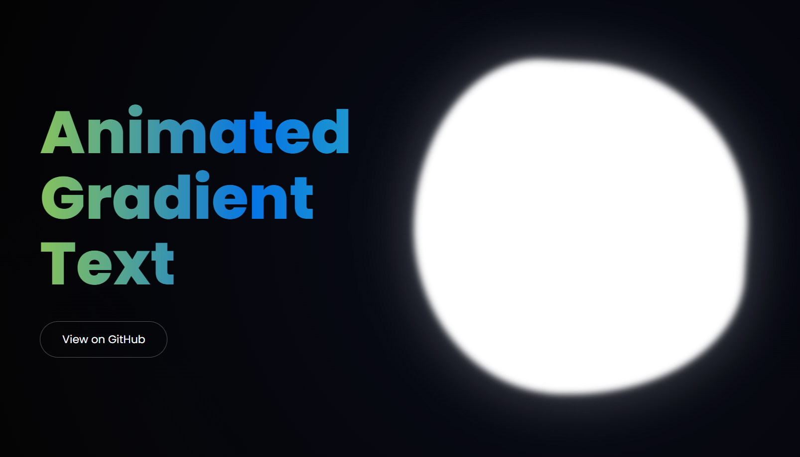

# Animated Gradient Text Hero

A visually striking, modern hero section featuring smooth animated gradient typography and a dynamic, glowing background. This project demonstrates high-impact UI effects using only vanilla HTML and CSS.



## ✨ Features

- **Dynamic Gradient Typography**: Smoothly cycling color gradients applied to the hero text for a premium feel.
- **Ambient Background Motion**: A glowing, blurred orb (blob) that moves gracefully, adding depth and life to the interface.
- **Translucent Overlay**: A dark, frosted-glass-inspired layer that ensures high contrast and readability.
- **Fully Responsive**: Designed to look great across different screen sizes.
- **Lightweight & Fast**: Built with zero dependencies, using only standard web technologies.

## 🛠️ Tech Stack

- **HTML5**: Semantic structure.
- **CSS3**: Advanced animations, custom properties, and `background-clip: text`.
- **Typography**: [Poppins](https://fonts.google.com/specimen/Poppins) via Google Fonts.

## 🚀 Getting Started

1. **Clone the repository:**
   ```bash
   git clone https://github.com/rajjitlai/Animated_Gradients.git
   ```
2. **Open the project:**
   Simply open `index.html` in any modern web browser.

## 📖 How it Works

The project utilizes several modern CSS techniques:
- **`background-clip: text`**: Allows the animated gradient to be applied directly to the font.
- **Keyframe Animations**: Handles the smooth color transitions and the movement of the background blob.
- **CSS Filters**: Uses `blur()` to create the ambient glowing effect for the background elements.

## 📄 License

This project is licensed under the MIT License - see the [LICENSE](LICENSE) file for details.

---

Created with ❤️ by [Rajjit Laishram](https://github.com/rajjitlai)
